# Obsidian for Academia

This repository is an attempt to create a collaborative documentation explaining all the forms to convert obsidian into an academic writing tool.

There is no single or definite form of achieving this. So here you will find all the possible setups with their benefits and drawbacks explained.

To see this workflow in action, watch this [video](https://youtube.com).

# Table of Contents

-   [How to setup](#how-to-setup)
    -   [Reference Manager integration](#reference-manager-integration)
        -   [Integrating Zotero](#integrating-zotero)
            -   [Importing your annotations](#importing-your-annotations)
        -   [Integrating other Reference manager](#integrating-other-reference-manager)
            -   [Importing your annotations](#importing-your-annotations-1)
    -   [Citations](#citations)
        -   [Zotero Integration](#zotero-integration)
        -   [Pandoc](#pandoc)
    -   [Creating bibliography](#creating-bibliography)
        -   [Zotero Integration](#zotero-integration-1)
        -   [Pandoc Reference List](#pandoc-reference-list)
        -   [Pandoc](#pandoc-1)
    -   [Exporting](#exporting)
        -   [Native](#native)
            -   [Caveats](#caveats)
            -   [Styling](#styling)
        -   [Pandoc](#pandoc-2)
            -   [Caveats](#caveats-1)
            -   [Exporting](#exporting-1)
            -   [Other formats](#other-formats)
            -   [Internal links](#internal-links)
    -   [Other](#other)
        -   [Combine notes](#combine-notes)
        -   [Improving Math writing](#improving-math-writing)
-   [Contributing](#contributing)
-   [Reference](#reference)

## How to setup

### Reference Manager integration

For the reference manager software, there are two alternatives. Either use [Zotero](https://zotero.org) or any other of your preference and use the [obsidian-citations](https://github.com/hans/obsidian-citation-plugin) plugin which uses the .bib file.

Zotero is really well integrated into obsidian, so preferably you should go with that.

#### Integrating Zotero

Here is what you need to install:

-   [Zotero 6 and Zotero Browser Connector](https://www.zotero.org/download/)
-   [Better Bibtex for Zotero](https://retorque.re/zotero-better-bibtex/) - Zotero plugin
-   [Zotero Integration](https://github.com/mgmeyers/obsidian-zotero-integration) - Obsidian plugin

Note: We are skipping the installation of Zotero and its plugins here, as well as the basics of Zotero, since these instructions are widely available on the web.

##### Importing your annotations

We'll use Zotero Integration to create notes that contain the full metadata, link to Zotero, as well as PDF annotations and notes.

For that, the plugin requires a template. We provide a standard one [here](./templates/literature-note-zotero). You can extend it to your needs following their [docs](https://github.com/mgmeyers/obsidian-zotero-integration/blob/main/docs/Templating.md).

The setup will look like:

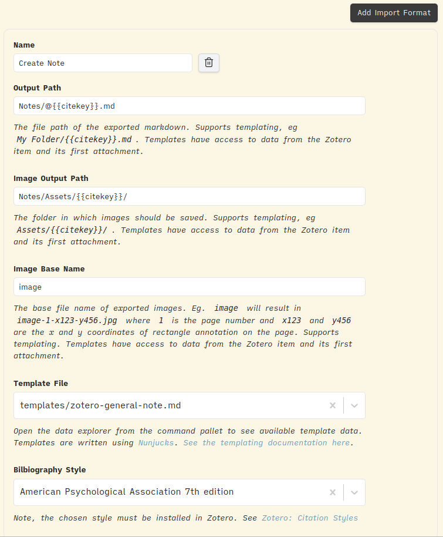

Note: It is important that you call the citations as @{{citekeys}}, you'll see why in [citations](#Citations).

After that, you would create a note by entering the command "Zotero Integration: Create Note" in the command palette.

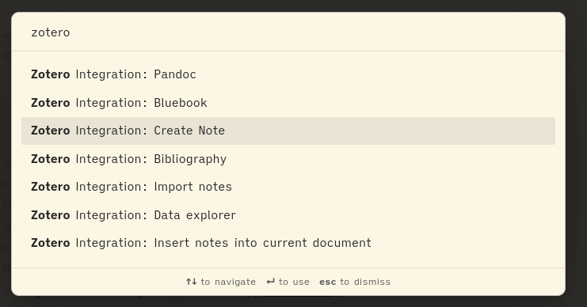

And this is how your notes will look like:

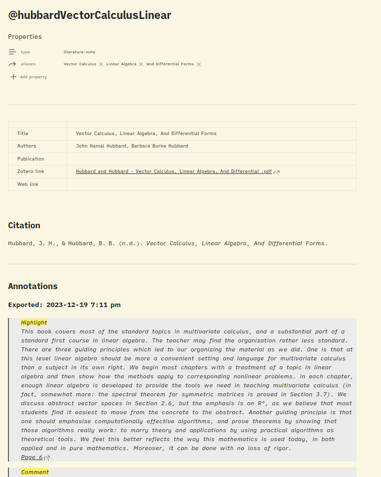

#### Integrating another Reference manager

As explained before you need to install the following:

-   [Obsidian Citations](https://github.com/hans/obsidian-citation-plugin) - Obsidian plugin

And then you have to export your library in .bib format. Then, you tell the plugin to use that file in the configuration.

##### Importing your annotations

For obvious reasons, this plugin lacks the features of the Zotero-Integration. So importing your notes won't be as rich as with Zotero.
Anyways, here you have a nice template:

```markdown
---
title: { { title } }
authors: { { authorString } }
year: { { year } }
---

# {{title}}

## {{authorString}}

## Abstract

{{abstract}}

## Note

{{note}}
```

There are probably other plugins that can improve this workflow, if you know one, don't hesitate to open a PR and improve this section!

### Citations

Citations are pretty straightforward. You have two options, do it manually through the Zotero Integration or by setting up pandoc. The latter is the preferred one since it allows to change between different citation styles easily and automatically.

Regardless of what you choose, we want to create the citation and at the same time link it to the note that has its annotations (in case we have created it). This way, we don't lose the graph view and some other features that Obsidian offers.

#### Zotero Integration

Citations can be added using the Zotero Integration plugin by configuring a certain citation style and then selecting that option in the command palette.

For example:


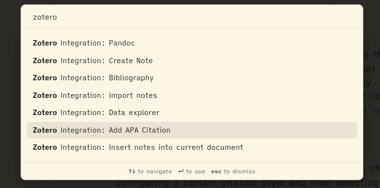

And then you could also connect the citation to its respective note:

```markdown
[CITATION_CREATED_BY_ZOTERO_INTEGRATION](/link_to_annotation)
```

#### Pandoc

You'll need to install:

-   [Pandoc](https://pandoc.orgl)
-   [Pandoc Reference List](https://github.com/mgmeyers/obsidian-pandoc-reference-list) - Obsidian plugin

Note: If you want to export your documents using pandoc, then you must use this form. Since pandoc will automatically create the citations for you.

Then you need to tell the plugin where the .bib file exported by your reference manager is located in the configuration.

Once you have configurated everything, you would cite following the pandoc format:
`[@CITE_KEY]`. Though, you should use the wiklink format `[@CITE_KEY](@CITE_KEY)`, this way you would be citing the source as well as connecting the note with the annotations (in case you created one). For this reason, you must import your annotations following the format `@{{citekey}}`.

By the way, you should activate the option "_Show citekey suggestions_" in the plugin to have autocompletion. Furthermore, you can set the Zotero Integration to cite in the pandoc style:

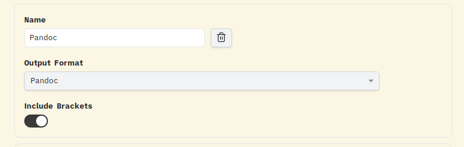

The great thing about this plugin is that it keeps all citations made through the note:

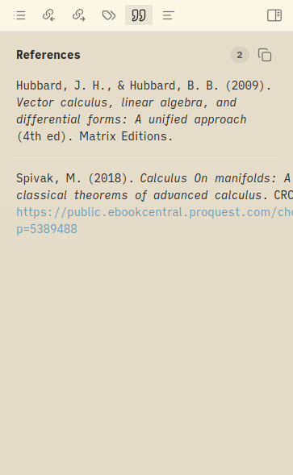

To view it, enter the command _"Pandoc Reference List: Show reference list"_ in the command palette.

### Creating bibliography

To create a bibliography, you have three options:

-   Manually doing it yourself with Zotero Integration
-   Use the Pandoc Reference List
-   Let pandoc create it for you automatically.

Let's see:

#### Zotero Integration

Create a configuration for citating bibliography on your desired style in the plugin settings. For example:

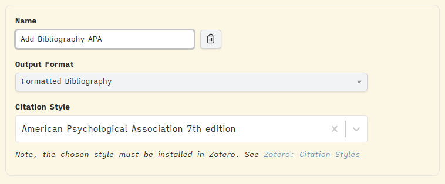

And then you introduce it by entering the command _"Zotero Integration: Add Bibliography APA"_ in the command palette.

#### Pandoc Reference List

You have to open the reference list and then press the copy button.

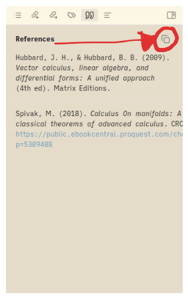

Then you would insert it wherever you want. If you change the citation style in the plugin settings or add new citations, then you have to do this again.

It is still kinda manual but it is still much faster than the previous method. This is the preferred method if you are not exporting the note with pandoc.

#### Pandoc

You can use this method if and only if you will **export the note using pandoc**. You need to provide the flags `--citeproc --bibliography --csl` when exporting. Refer to the [Exporting section](#exporting) where this is explained.

This way, your bibliography will be automatically inserted at the bottom when exporting the note.

### Exporting

You should know that there are two ways _-maybe there are other forms, but these are the most popular among the community-_ of exporting your documents: Through **Pandoc** or using the Obsidian **native** functions. If you choose the former, you should know that you must forfeit many obsidian features explained in [here](#caveats2).

#### Native

##### Caveats

There are two caveats to this approach:

1. Internal links don't work (this is [quite a requested feature in the obsidian community](https://forum.obsidian.md/t/pdf-export-make-links-within-same-document-functional/16384), maybe we'll get it soon).
2. Can't add a header and a footer.

##### Styling

We want to make the document look as closely as possible to latex, which is the standard when doing academic documents. For that, add this [css snippet](./.obsidian/snippets/paper.css) and activate it. Check the [official guide](https://help.obsidian.md/Extending+Obsidian/CSS+snippets) for help.

Then you need to provide the property `cssclass: paper` or

```yaml
cssclasess:
    - paper
```

In the note, you want to export. This will activate the academic style when exporting the note.

For example:

| Source               | Exported             |
| -------------------- | -------------------- |
| 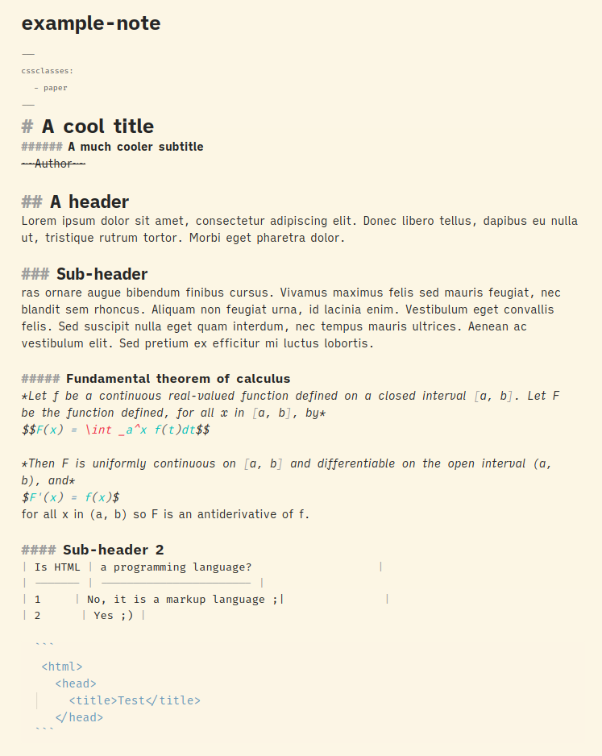 | 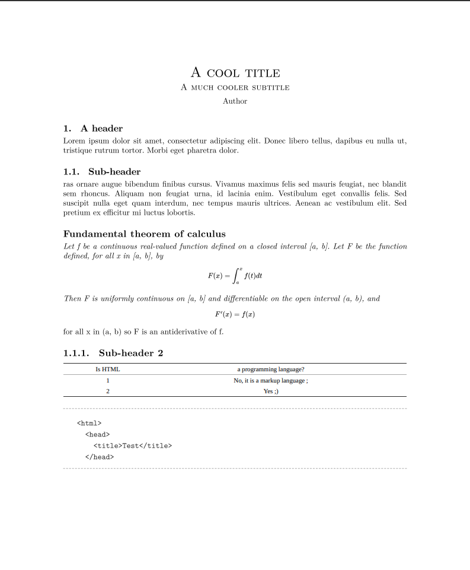 |

Additionally, you can also provide the class `columns` so that it renders the document in two columns. This way, your properties should look like:

```yaml
cssclasess:
    - paper
    - columns
```

See the style in action:

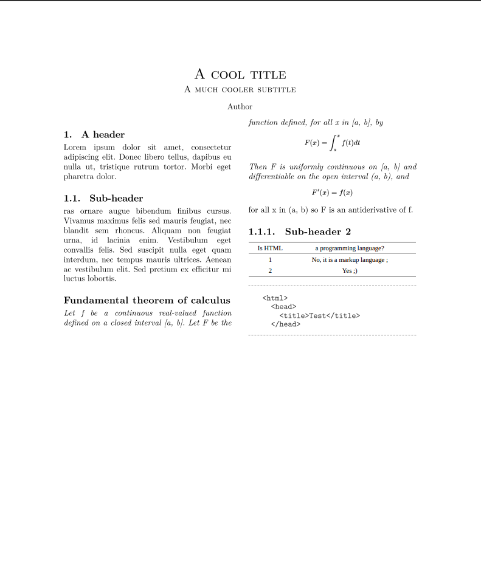

Feel free to extend this snippet to suit your needs better and send a PR if you think it can be improved(surely you do).

#### Pandoc

##### Caveats

If you choose to export using pandoc then you must forfeit features like DataView tables, callouts, and Templater. Any feature that relies on markdown processing. Though you can find workarounds through plugins, lua scripts, etc we won't cover them here.

##### Exporting

You need to install:

-   [Pandoc](https://pandoc.org/installing.html)
-   [A Latex engine](https://www.tug.org/texlive/)
-   [Obsidian Pandoc](https://github.com/OliverBalfour/obsidian-pandoc)(optional) - Obsidian plugin
-   [Templater](https://github.com/SilentVoid13/Templater) - Obsidian Plugin

If you've been reading the readme, you should know that if you are using pandoc export, then the citations and the bibliography are created by this tool.

To export the document you can do it through the Obsidian Pandoc plugin or via the CLI. They actually are the same thing, only that the former is a wrapper of the latter.

We provide you with a [template](./templates/pandoc-export.md) that includes all the properties and metadata commonly used. They are all read by pandoc when exporting. You can see what each one does [here](https://pandoc.org/MANUAL.htmls).

Note: You could create a header file which you would then provide to pandoc with the `-H` flag, instead of declaring everything in the note properties. See more [here](https://pandoc.org/MANUAL.html#general-writer-options)

Then when you want to create a note that you will later export with pandoc you should enter the command "_Templater: Create new note from template_" and select the one for pandoc. For some reason, you can't use the native template function because it fails to insert the template.

Wikilinks don't work with pandoc out of the box. To make them work we need to tell pandoc to use the _wikilinks_title_after_pipe_ extension. Which we do by providing the flag `--from=markdown+wikilinks_title_after_pipe`.

You can configure the Obsidian Pandoc to add it to all the exports.

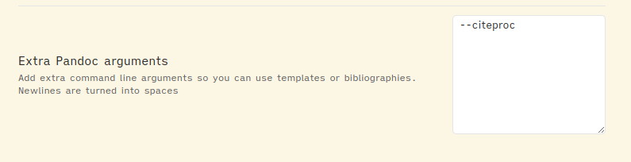

To export the document using the Obisidan Pandoc plugin you just enter the command "_Pandoc Plugin: Export as PDF_".

If you want to go with the CLI style, then enter

```bash
pandoc <PATH_TO_NOTE>.md -o ./output.pdf --from=markdown+wikilinks_title_after_pipe
```

Note: we are not passing the common flags you will see in other guides because they are all passed through the document properties. For example, you could provide the bibliography, citeproc, and csl flags in the extra arguments field in the Obsidian Pandoc settings.

To see an example see

| Source                      | Exported                 |
| --------------------------- | ------------------------ |
| [markdown](example-note.md) | [ pdf](example-note.pdf) |

##### Other formats

The great thing about pandoc is that not only can you export your documents as PDFs but to any other format you can think of, such as docx, epub, html, and many more. Check their [docs](https://hackage.haskell.org/package/pandoc) to see how.

##### Internal links

The great thing about pandoc is that you can make internal links work. See more [here](https://pandoc.org/chunkedhtml-demo/7.2-headings-and-sections.html) and [here](https://pandoc.org/chunkedhtml-demo/8.3-headings.html#heading-identifiers).

But basically, pandoc assigns an identifier to every header which is its name in undercaps. So to link to a header you would do `[click here](#header-name-in-undercaps-and-separated-by-hyphens)`.

### Other

#### Combine notes

If you are writing a long document, chances are you are writing each section in a separate file. To merge all the content into a single file when exporting all the files you can do it through pandoc or obsidian.

**pandoc**

`pandoc ./note_1.md ./note_2.md ... ./note_n.md -o output.pdf`

or if everythinng is inside a folder:

`pandoc ./folder/*.md -o output.pdf`

**obsidian**

With obsidian, you just simply call all the notes into one

```markdown
![[note_1]]
![[note_2]]
![[note_3]]
.
.
.
![[note_n]]
```

#### Improving Math writing

(TO_BE_ADDED)

---

## Contributing

As said before, this repository tries to be the ultimate guide on how to setup Obsidian for academia, and for that, it'll be nice if you could contribute with your experience, workarounds, and workflows. If you know of any form of improvements(from the clarity and redaction of the documentation to new ways of configuring Obsidian), or if you encounter an issue, please don't hesitate to open an issue or, better still, create a PR. We'll surely review it and accept it. Thanks in advance :).

## Reference

https://publish.obsidian.md/hub/04+-+Guides%2C+Workflows%2C+%26+Courses/for+Academic+Writing
